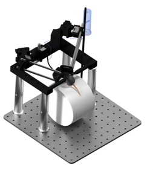
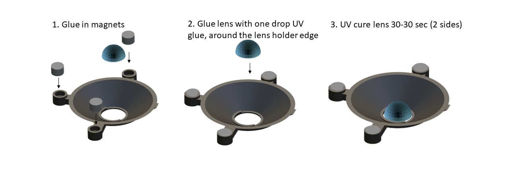
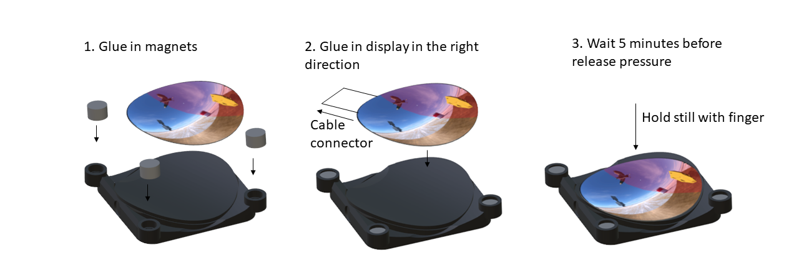
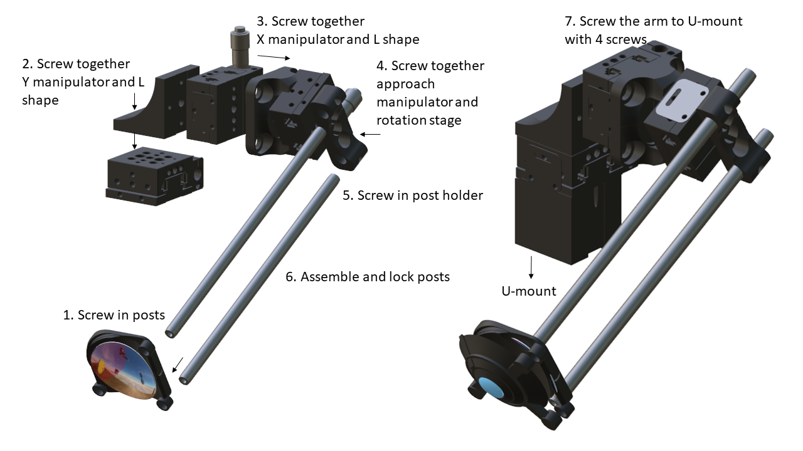
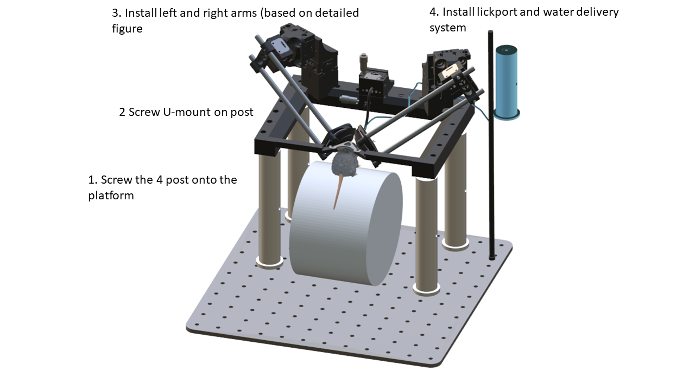

# Overview
This repository contains [Assembly Instructions](https://github.com/DombeckLab/IMRSIV#assembly-instructions), [3D models](https://github.com/DombeckLab/IMRSIV/tree/main/STL), [Zemax models](https://github.com/DombeckLab/IMRSIV/tree/main/Zemax), and Unity environment [files](https://github.com/DombeckLab/IMRSIV/tree/main/Unity_project) and builds ([high quality](https://github.com/DombeckLab/IMRSIV/tree/main/Ultra_Quality_Demos)/[medium quality](https://github.com/DombeckLab/IMRSIV/tree/main/Medium_Quality_Demos)) related to a manuscript under review.

# Assembly Instructions

## 3D printed parts
[3D models](https://github.com/DombeckLab/IMRSIV/tree/main/STL)
- U-Mount.stl
- Left_Wing.stl
- Left_Lens_Holder.stl
- Right_Wing.stl
- Right_Lens_Holder.stl
- headplate_iMRSIV.stl

## Zemax Files 
[Zemax models](https://github.com/DombeckLab/IMRSIV/tree/main/Zemax)
- MouseEye_Lens.zmx
- MouseEye_Monitor.zmx

## Thorlabs Parts 

- Thorlabs rotation stages: RP005 (2x)
- Post holders: CP02B - 30 mm Cage Mounting Bracket (2x)
- Mini cage posts: MS3R (4x)
- Pillar posts for U-mount (RS4P8E), (4x)
- Thorlabs 3-axis stage: 2x3X MS1S / ARM
- Thorlabs 90 degree angle bracket AB90E 
- Thorlabs imperial, breadboard 1/4-20 tapped holes on 1" centers (1x)

 ## Electronic Parts  
- Displays: 1.4 inch Innolux display (2x), with HDMI controllers (2x) (From Aliexpress 2x KITS)
- Lens: Shanghai Optics, d=12mm, R1=60deg, R2=10deg, CT=4 mm (company contact and stl file) + Zemax files, lens and eye  (2x)
  
 ## Misc
- Norland Optical Adhesive NOA 81, 1 oz.
- Quick glue
- Double component epoxy glue
- 4-40 screw kit
- 3-32 screw kit
- 1/4 screw kit

  
## Left and Right Wing assembly

Print Left_wing.stl. Recommended material is Tough PLA. (Classic PLA is still good) with Z resolution 0.1 mm at least. Finish 3D printing with a fine file or sandpaper, especially the lens holder contact.
1. Glue the 3 magnets into the magnet holes, with Quick glue
2. Set the lens holder on a flat surface (ie. a glass sheet), Put the lens into the holders ring. Apply Norland UV glue and
3. Cure both sides with 60 sec of UV light (300 mw/mm2)

 Repeat steps with Right_wing.stl

## Left and Right display holder glueing

Print Left and Right wing.stl and finish the edges with fine file
1. Glue in the 3 magnets
2. Apply double component epoxy glue on surface, and carefully adjust the display to the final position. (Connector orientation marked on figure)
3. Hold at least 5 minutes with your finger in bended position, wait another 5 minutes. 

   
## Arm assembly

1. Screw posts into the display holder
2. Scew together Y manipulator and L-shape
3. Screw together X manipulator (and arm) and (Thorlabs angle bracket)
4. Screw together approach manipulator and rotation stage
5. Screw post holder onto rotation stage
6. Assemble and lock posts in postholder
7. Screw the whole arm onto the U-mount with 4 screws

## Setup assembly

1. Screw the 4 pillar posts onto the platrform
2. Screw U-mount on post
3. Install and screw on the 2 arms
4. Install any desired components for behavior by mounting to the breadboard or the U-mount
5. Set up display HDMI controllers onto Thorlabs posts, and securely connect displays after assembly
   
   

