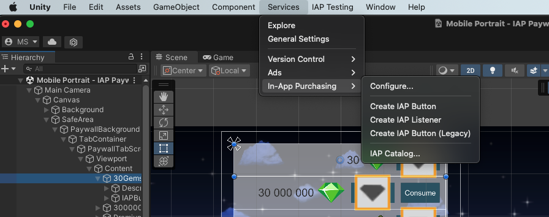
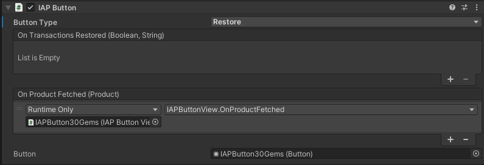

# IAP Button

IAP Button is a way to purchase or restore products without writing code.

## Adding IAP Button to the Scene

To add an __IAP Button__ to your Scene, in the Unity Editor, select __Window &gt; Unity IAP &gt; Create IAP Button__.



## Handling OnProductFetched
This event will be triggered when IAP retrieves product information from the app stores. It is a good idea to update all text related to the product in the UI with this event such as title, description and price.

**On Product Fetched script example**:
```
public class IAPButtonView : MonoBehaviour
{
    [SerializeField]
    Text title;
    [SerializeField]
    TMP_Text price;

    public void OnProductFetched(Product product)
    {
        if (title != null)
        {
            title.text = product.metadata.localizedTitle;
        }

        if (price != null)
        {
            price.text = product.metadata.localizedPriceString;
        }
    }
}
```

A script like above can be added to the IAPButton to link different views with this event.

## Restore Button
Some app stores, including iTunes, require apps to have a __Restore__ button. Codeless IAP provides an easy way to implement a restore button in your app.

To add a __Restore__ button:

1. Add an __IAP Button__ to your Scene (**Services** &gt; **In-App Purchasing** &gt; **Create IAP Button**).
2. With your __IAP Button__ selected, locate its **IAP Button (Script)** component in the Inspector, then select **Restore** from the **Button Type** drop-down menu (most of the component's other fields will disappear from the Inspector view).
   
3. (Optional) You can add a script by clicking the plus (**+**) button to add a script to the **On Transactions Restored (Boolean, String)**.
4. (Optional) Drag the GameObject with the restore transactions script onto the event field in the component’s Inspector, then select your function from the dropdown menu.

**On Transactions Restored script example**:

```
public void OnTransactionsRestored(bool success, string? error)
{
    Debug.Log($"TransactionsRestored: {success} {error}");
}
```

When a user selects this button at run time, the button calls the purchase restoration API for the current store. This functionality works on the iOS App Store, the Mac App Store and the Windows Store. You may want to hide the __Restore__ button on other platforms.

Unity IAP will always invoke the __On Transactions Restored (Boolean, String)__ function on the __Restore IAP Button__  with the result and the associated error message if the restore fails.
If the restore succeeds, Unity IAP invokes the __On Purchase Complete (Product)__ function on the __IAP Button__ associated with that Product.
